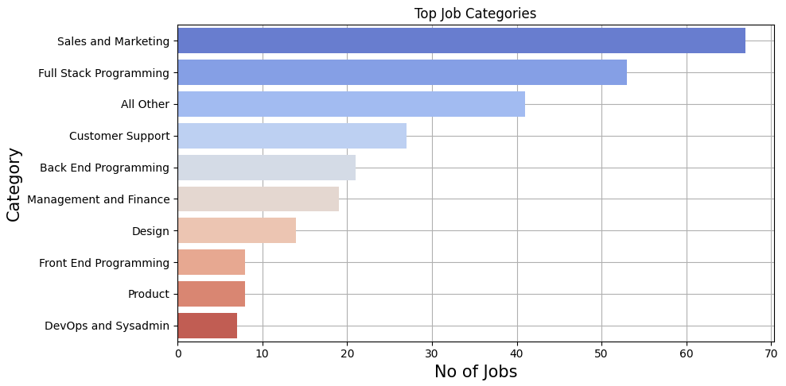
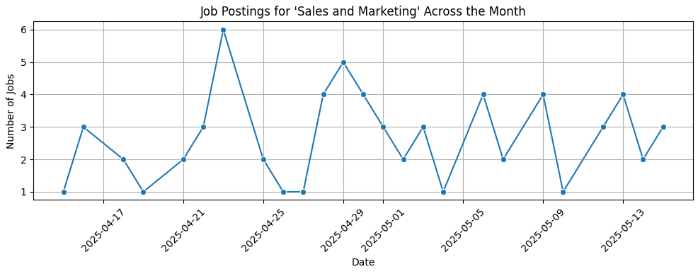
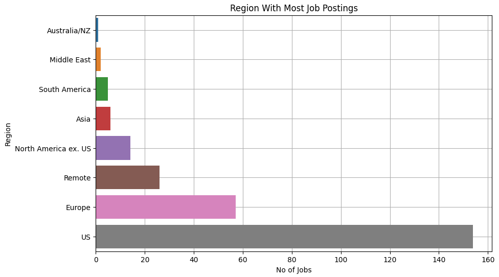

🧠 Job Listings EDA from We Work Remotely

This project performs Exploratory Data Analysis (EDA) on remote job listings collected from We Work Remotely. It involves web scraping, data cleaning, and insightful visualizations to understand job trends and opportunities in the remote work ecosystem.

📁 Project Structure

.
├── scraping.ipynb        # Scrapes job listings using Selenium
├── data_cleaning.ipynb   # Cleans and preprocesses the raw data
├── eda_analysis.ipynb    # Performs EDA, visualization, and record insights
├── jobs_raw.csv          # Raw scraped data
├── jobs_cleaned.csv      # Cleaned data used for analysis
├── requirements.txt      # Required libraries to install
└── README.md             # Project documentation

🚀 Features

    Automated job listing extraction using Selenium
    Cleaning and formatting scraped data into a structured CSV file

    Visualizations of:
        Most in-demand job categories
        Top companies hiring per category
        Companies with most job openings
        Which day sees more job postings
        Job postings for category across the month
        Region with most job openings
        Distribution of job postings per category over time
        
    Key insights and observations from the job market

🛠 Technologies Used

    Python
    Selenium (Web scraping)
    undetected_chromedriver (Bypass Bot Protection)
    Pandas / NumPy (Data cleaning and manipulation)
    Matplotlib / Seaborn (Data visualization)
    Jupyter Notebooks

⚙️ How to Run

    Clone the repo - Run this command in your terminal or command prompt.
"
    git clone https://github.com/d-binu163/job_listings_eda_project_1.git
    cd job_listings_eda_project_1

Install dependencies

    pip install -r requirements.txt
    
    Run the notebooks in order:
        scraping.ipynb
        data_cleaning.ipynb
        eda_analysis.ipynb
    
    Note: The scraper uses Selenium with undetected_chromedriver to bypass basic bot protection. Make sure you have a compatible version of Chrome installed,                and the undetected ChromeDriver will be automatically managed. No need to manually add ChromeDriver to your PATH.

📊 Example Visualizations

📌 Possible Future Work

    Automate regular scraping with scheduling
    Obtain job descriptions and salary to conduct further analysis using Machine Learning.
    Deploy dashboards using Streamlit or Dash
    Scrape additional job boards (e.g., RemoteOK, Indeed)

📃 License

MIT License - Free usage of project.
